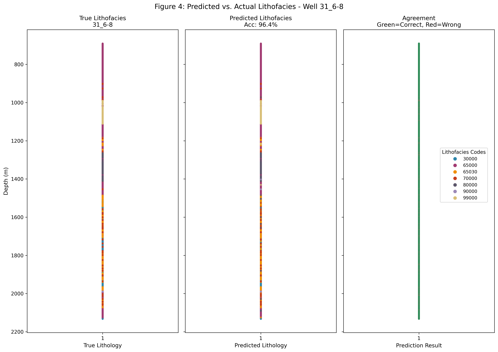

# Automated Lithofacies Classification from Well Logs Using Random Forest

**Author:** Dein Honour Davies  
**ORCID:** 0009-0006-7597-256X  
**Repository:** https://github.com/dhdaviescode-star/lithofacies-classification-force2020

---

## Overview

This repository contains the complete code and figures for the manuscript:

> *"Automated Lithofacies Classification from Well Logs Using Random Forest: A Benchmark Study on the FORCE 2020 Dataset"*  
> (Manuscript in preparation)

A Random Forest classifier was developed to automatically classify lithofacies from standard well logs, achieving **90.6% accuracy** on the FORCE 2020 dataset (21 wells, 258,903 depth samples).

---

## Key Results

| Metric | Result |
|--------|--------|
| **Overall Accuracy** | **90.6%** |
| Training Samples | 102,588 |
| Test Samples | 30,776 |
| Wells Integrated | 21 |

## Random Forest Model Specification

- **Number of trees:** 100 (`n_estimators=100`)
- **Voting mechanism:** Hard majority voting
- **Feature subspace:** √p = 2 features per split (p = 5 total)

### Voting Equation

The ensemble predicts the class with the majority of tree votes:

`ŷ = mode { h₁(x), h₂(x), ..., h₁₀₀(x) }`

or formally: `ŷ = argmax_c Σ_{t=1}^{100} 𝕀(h_t(x) = c)`

where 𝕀(·) is the indicator function and c is a lithofacies class.

### Feature Importance Ranking

| Feature | Importance |
|---------|------------|
| Neutron Porosity (NPHI) | 22.7% |
| Gamma Ray (GR) | 22.5% |
| Sonic Transit Time (DTC) | 20.5% |
| Bulk Density (RHOB) | 17.9% |
| Deep Resistivity (RDEP) | 16.4% |

---

## Repository Structure

```
lithofacies-classification-force2020/
├── README.md                          # This file
├── requirements.txt                   # Python dependencies
├── LICENSE                            # MIT License
├── figures/figure2_confusion_matrix.png               # Figure 2 (publication-ready)
├── figures/figure3_feature_importance.png             # Figure 3 (publication-ready)
├── figures/figure1_distribution.png       # Figure 1 (publication-ready)
└── notebooks/                         # (Contains Well_log_Research.ipynb)
    └── Well_log_Research.ipynb            # Complete Colab workflow
```

---

## Reproducing the Results

### Prerequisites

- A **Kaggle account** (free) with an API token
- Google Colab or a local Python 3.12 environment

### Step 1: Clone the Repository

```bash
git clone https://github.com/dhdaviescode-star/lithofacies-classification-force2020.git
cd lithofacies-classification-force2020
```

### Step 2: Install Dependencies

```bash
pip install -r requirements.txt
```

### Step 3: Set Up Kaggle API Token

1. Log in to [Kaggle.com](https://www.kaggle.com/)
2. Go to Your Profile → Account → API → Create New API Token
3. Download `kaggle.json`
4. Upload it to your Colab environment or save to `~/.kaggle/`

### Step 4: Run the Analysis

**Option A: Google Colab (Recommended)**

Open Google Colab and run the following cells to:
- Download the FORCE 2020 dataset
- Load and combine 21 wells
- Train the Random Forest model
- Generate all figures

**Option B: Local Machine**

Run the Python script that replicates the Colab notebook workflow.

---

## Dataset

The **FORCE 2020 Well Logs Dataset** (Azzam, 2020) is publicly available on Kaggle:

- **Source:** https://www.kaggle.com/datasets/faresazzam/well-logs-dataset-for-machine-learning
- **License:** MIT
- **Description:** 118 wells from the Norwegian Sea with standard well logs and interpreted lithofacies

---

## Figures

| Figure | File | Description |
|--------|------|-------------|
| Figure 1 | `figures/figure1_distribution.png` | Class distribution in training dataset (n=102,588) |
| Figure 2 | `figures/figure2_confusion_matrix.png` | Confusion matrix for test set predictions |
| Figure 3 | `figures/figure3_feature_importance.png` | Random Forest feature importance ranking |

All figures are saved at **300 DPI**, publication-ready.

---

## Requirements

The `requirements.txt` file includes:

```
pandas>=2.0.0
numpy>=1.24.0
scikit-learn>=1.2.0
matplotlib>=3.7.0
seaborn>=0.12.0
kaggle>=1.5.0
```

---

## How to Cite

If you use this code or data in your research, please cite:

> Davies, D.H. (2026). Automated Lithofacies Classification from Well Logs Using Random Forest: A Benchmark Study on the FORCE 2020 Dataset. *[Manuscript under review at ***]*. Code available at: https://github.com/dhdaviescode-star/lithofacies-classification-force2020

---

## License

This project is licensed under the **MIT License** – see the `LICENSE` file for details.

You are free to use, modify, and distribute this code with attribution.

---

## Contact

**Dein Honour Davies**  
Email: deinhdavies@gmail.com  
GitHub: https://github.com/dhdaviescode-star  
ORCID: 0009-0006-7597-256X

For PhD supervision inquiries or collaboration on CCUS, reservoir geomechanics, or machine learning in geoscience, please reach out.

---

## Acknowledgments

- The FORCE Machine Learning Competition organizers for providing the dataset
- Kaggle platform for data hosting
- The open-source Python community (pandas, scikit-learn, matplotlib, seaborn)

---

## Status

- [x] Data acquisition and integration (21 wells)
- [x] Random Forest model training (90.6% accuracy)
- [x] Figures generation (300 DPI)
- [x] GitHub repository setup
- [x] Full Jupyter notebook upload (Well_log_Research.ipynb)
- [ ] Conda environment specification (coming soon)
- [ ] Docker container (future)

---

*Last updated: June 2026*


## Figure 4: Depth-Track Visualization

The model was tested on well 31_6-8 (9,481 samples, held out from training), achieving **96.4% accuracy**.



*Figure 4: Depth-track comparison of true versus predicted lithofacies for well 31_6-8 from the test set. Left: true lithology; middle: Random Forest predictions; right: correct predictions (green) versus errors (red). Perfect classification is observed in the uniform shale interval (690-721 m). Mismatches occur primarily in transitional zones where log responses overlap. Depth increases downward following petrophysical convention (Al-Mudhafar 2020; Hall 2016).*

---

## Updated Results Summary

| Metric | Result |
|--------|--------|
| Overall Accuracy | 90.6% |
| Blind Well Accuracy (31_6-8) | 96.4% |
| Most Important Feature | NPHI (22.7%) |
| Second Most Important | GR (22.5%) |

